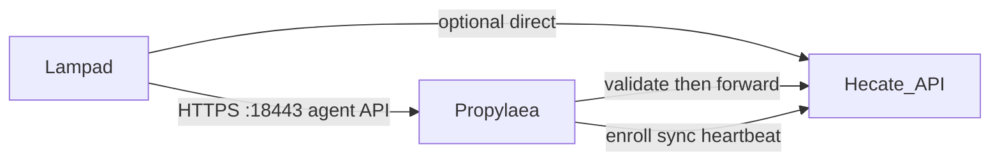

# Propylaea architecture

## Threat model

- Propylaea is Internet-exposed; Hecate may remain on a private network or also be reachable.
- Only `/api/v1/agent/*` is accepted. UI, admin, MCP, and `/internal/*` return 404.
- Signed agent requests are verified (Ed25519, clock skew, nonce anti-replay) against a locally synced key cache before any upstream call.
- Enrollment is prechecked against synced token HMACs using the shared `API_KEY_PEPPER`; the one-shot claim remains on Hecate.
- If the proxy is revoked or sync returns 403, forwarding stops (fail closed).
- Hecate always re-validates; Propylaea is an early filter, not a trust boundary replacement.

## Identity

Proxies enroll like machines: admin creates a `penr_…` token, Propylaea posts `/api/v1/proxy/enroll`, then signs sync/heartbeat with the same header scheme as agents (`X-Hecate-Agent-Id` carries the proxy UUID).
